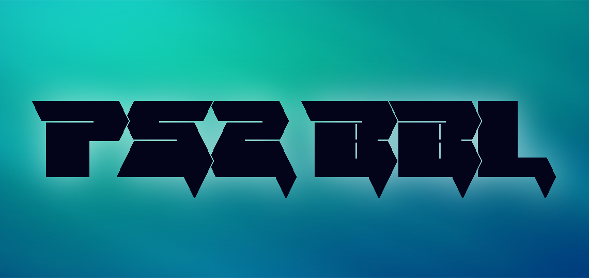

 

  

  

    A flexible BootLoader for PlayStation 2™ and PSX-DESR
     
  

  

capable of properly initializing the system, loading discs (ps1, ps2, dvd-video) and running software from several storage devices. PS2BBL can compete with other well known bootloaders such as FreeMcBoot. 

This program is based on a set of osd initialization samples written by @sp193 itself, creator of the FreeMcBoot 1.9 series. so it is capable of doing it's job as well as FreeMcBoot does.

<a href="./documentation" class="link-mktg arrow-target-mktg text-semibold f3-mktg">Enter the docs</a>
